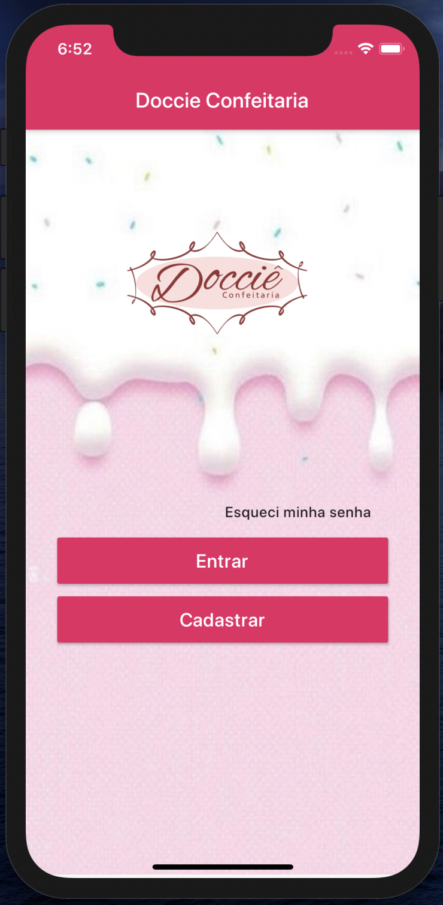

# Doccie Confeitaria

Aplicativo de e-commerce para uma confeitaria. 

Desenvolvido para a disciplina de Construção de Software no curso de Sistemas de Informação.

## Getting Started

Para obter ajuda sobre como iniciar o Flutter, consulte nossa [documentação](https://flutter.io/) on-line .

## Screenshots

| Tela Login | Tela Cadastro | Tela Lista de Produtos |
| --------|--------|--------|
||||
| Tela Bolos | Tela CupCakes | Tela Doces |
| --------|--------|--------|
||||

